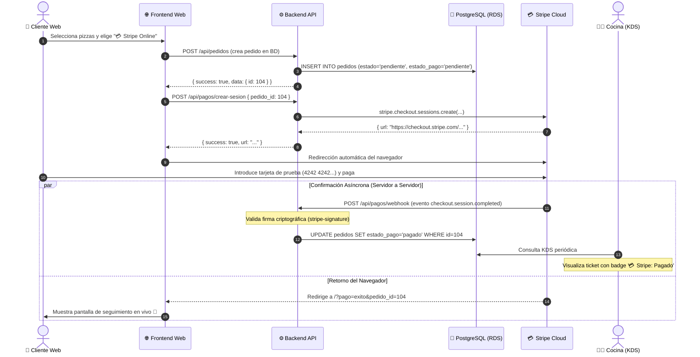

# Práctica 07: Integración de Pasarela de Pagos Stripe (Checkout y Webhooks)

> **Módulo:** Desarrollo de Aplicaciones Web (DAW) & Desarrollo de Aplicaciones Multiplataforma (DAM)  
> **Centro:** IES La Mola  
> **Objetivo didáctico:** Implementar un flujo de pago digital profesional utilizando **Stripe Checkout** y **Webhooks asíncronos**, aplicando el patrón de diseño de **Degradación Elegante (*Graceful Degradation*) y *Feature Flags*** para garantizar que la plataforma funcione al 100% tanto con pasarela activa como sin ella.

---

## 1. Arquitectura del Flujo de Pagos

El flujo de pago combina sincronía (redirección del cliente a la pasarela bancaria) y asincronía (confirmación segura de servidor a servidor vía Webhook):



---

## 2. Garantía de Aislamiento y Compatibilidad (Feature Flag)

Para que ningún alumno quede bloqueado si no desea crear una cuenta de Stripe:

* **Sin claves en `.env`:** El backend arranca con normalidad. Muestra en consola `ℹ️ [Stripe] Pasarela de pagos inactiva (STRIPE_SECRET_KEY no configurada)`.
* **Pedidos estándar:** Los pagos en **"💵 Efectivo"** y **"💳 Datáfono"** siguen el flujo nativo tradicional sin invocar a Stripe en ningún momento.
* **Integridad de Base de Datos:** Los estados operativos de cocina (`'pendiente'`, `'en_preparacion'`, `'listo'`, `'entregado'`) permanecen intactos dentro de su restricción `CHECK`. El pago se gestiona en la columna complementaria `estado_pago`.

---

## 3. Guía Paso a Paso para Alumnos que Activan Stripe

### Paso 1: Registro y "La Trampa de Activación"
1. Regístrate gratis con tu correo en [dashboard.stripe.com/register](https://dashboard.stripe.com/register).
2. ⚠️ **CRÍTICO:** Ve a la bandeja de entrada de tu correo y pulsa el enlace de verificación de Stripe. Si no confirmas tu correo, muchas opciones del panel estarán bloqueadas.
3. Al entrar al panel verás un botón enorme que dice **"Activar pagos" / "Activate payments"**. **NO LO PULSES BAJO NINGÚN CONCEPTO**. Ese botón inicia un proceso legal y fiscal para empresas reales (pide DNI, cuentas bancarias, etc.).
4. Asegúrate de que el interruptor de la barra superior derecha dice **"Modo de prueba" (Test mode)** activado.

---

### Paso 2: Obtener la Clave Secreta (`STRIPE_SECRET_KEY`)
1. En la esquina inferior izquierda de la pantalla, haz clic en **`</> Desarrolladores`** (icono de código).
2. En el menú lateral izquierdo que se abre, haz clic en **Claves de API**.
3. Localiza la fila **Clave secreta** (*Secret key*).
4. Pulsa en **Revelar clave de prueba** y cópiala. Siempre empieza por **`sk_test_...`**.

---

### Paso 3: Configurar el Webhook (El Asistente de 3 Pasos)
Para que los servidores de Stripe puedan avisar de forma asíncrona a tu base de datos cuando el cliente paga, debemos registrar la URL de tu túnel de Cloudflare:

1. Tras copiar la clave, es posible que Stripe haya contraído el menú lateral izquierdo. Si es así, vuelve a hacer clic en **`</> Desarrolladores`** abajo a la izquierda.
2. Haz clic en la pestaña **Webhooks**.
3. Al ser tu primer webhook, la pantalla central estará vacía. Haz clic en el botón morado **"+ Añade un destino"**. Se abrirá directamente un asistente de 3 pantallas:
   * **Pantalla 1 (Elegir eventos):**
     * En el bloque *"Ámbito del destino"*, asegúrate de que **"Tu cuenta"** está seleccionado.
     * Ignora el desplegable de versión de la API y haz scroll hacia abajo hasta la barra de búsqueda de eventos.
     * Escribe exactamente: `checkout.session.completed`
     * Marca su casilla para seleccionarlo y haz clic en el botón **Continuar**.
   * **Pantalla 2 (Elegir tipo de destino):**
     * Haz clic en la tarjeta **Punto de conexión de webhook** *(ignora las opciones de Amazon EventBridge y Azure)*.
     * Haz clic en el botón **Continuar**.
   * **Pantalla 3 (Configurar tu destino):**
     * Puedes ignorar el *"Nombre del destino"* autogenerado.
     * En la caja **URL del punto de conexión**, escribe tu dominio exacto de Cloudflare terminado en la ruta de tu API.  
       👉 *Ejemplo:* `https://dam-XX.guillermofoix.org/api/pagos/webhook` *(o `daw-XX`, sustituyendo `XX` por tu número y **sin** barra `/` al final)*.
     * Haz clic en el botón **Crear destino**.

---

### Paso 4: El Secreto de Firma y el archivo `.env`
1. Tras crear el destino, aparecerá la pantalla de resumen del webhook. Busca el apartado **Secreto de firma** (*Signing secret*), pulsa en **Revelar** y copia el código que empieza por **`whsec_...`**.
2. Abre y edita el archivo `.env` en la raíz de tu proyecto en la máquina EC2 (`nano .env`):

```env
# 5. PASARELA DE PAGOS STRIPE
STRIPE_SECRET_KEY=sk_test_51...TU_CLAVE_SECRETA_AQUI
STRIPE_WEBHOOK_SECRET=whsec_...TU_SECRETO_WEBHOOK_AQUI
FRONTEND_URL=https://dam-XX.guillermofoix.org
```

> ⚠️ **ATENCIÓN:** Al pegar las claves, asegúrate de que no quede ningún espacio en blanco ni saltos extra al final de la línea. Sustituye `dam-XX` por tu subdominio asignado.

---

### Paso 5: Aplicar los cambios en Docker y Verificar
Para que el contenedor de Node.js cargue las nuevas variables de entorno en su memoria, recrea el servicio:

```bash
docker compose -f docker-compose.app.yml up -d backend
```

Verifica en los logs del contenedor que la pasarela ha arrancado en modo activo:
```bash
docker logs pizzeria-prod-backend --tail 15
# Deberías ver: 💳 [Stripe] Pasarela de pagos inicializada en modo activo.
```

*(O ejecuta el script de auditoría `bash scripts/audit_db_connection.sh` para certificar los 3 checks de Stripe en verde).*

---

## 4. Pruebas y Tarjetas de Test

Al tramitar un pedido con opción **"💳 Stripe"**:
* Se abrirá la pasarela segura alojada por Stripe.
* Utiliza una tarjeta de crédito de prueba oficial de Stripe:
  - **Número de tarjeta:** `4242 4242 4242 4242`
  - **Fecha de caducidad:** Cualquier fecha futura (ej: `12/28`)
  - **CVC:** `123`
  - **Código Postal:** `03660` (o cualquiera)
* Tras completar el pago, Stripe te redirige a la web de la pizzería con confirmación visual en verde y el KDS de cocina mostrará el pedido con la etiqueta **`💳 Stripe: Pagado`**.
