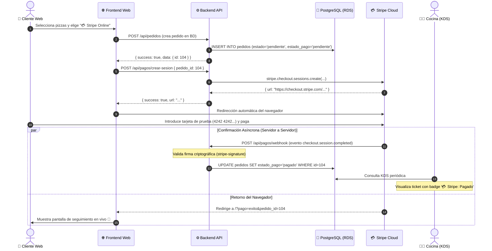

# Práctica 07: Integración de Pasarela de Pagos Stripe (Checkout y Webhooks)

> **Módulo:** Desarrollo de Aplicaciones Web (DAW) & Desarrollo de Aplicaciones Multiplataforma (DAM)  
> **Centro:** IES La Mola  
> **Objetivo didáctico:** Implementar un flujo de pago digital profesional utilizando **Stripe Checkout** y **Webhooks asíncronos**, aplicando el patrón de diseño de **Degradación Elegante (*Graceful Degradation*) y *Feature Flags*** para garantizar que la plataforma funcione al 100% tanto con pasarela activa como sin ella.

---

## 1. Arquitectura del Flujo de Pagos

El flujo de pago combina sincronía (redirección del cliente a la pasarela bancaria) y asincronía (confirmación segura de servidor a servidor vía Webhook):



---

## 2. Garantía de Aislamiento y Compatibilidad (Feature Flag)

Para que ningún alumno quede bloqueado si no desea crear una cuenta de Stripe:

* **Sin claves en `.env`:** El backend arranca con normalidad. Muestra en consola `ℹ️ [Stripe] Pasarela de pagos inactiva (STRIPE_SECRET_KEY no configurada)`.
* **Pedidos estándar:** Los pagos en **"💵 Efectivo"** y **"💳 Datáfono"** siguen el flujo nativo tradicional sin invocar a Stripe en ningún momento.
* **Integridad de Base de Datos:** Los estados operativos de cocina (`'pendiente'`, `'en_preparacion'`, `'listo'`, `'entregado'`) permanecen intactos dentro de su restricción `CHECK`. El pago se gestiona en la columna complementaria `estado_pago`.

---

## 3. Guía Paso a Paso para Alumnos que Activan Stripe

### Paso 1: Obtener claves gratuitas de prueba en Stripe
1. Entra en [https://dashboard.stripe.com/register](https://dashboard.stripe.com/register) y regístrate (gratis, modo de prueba por defecto).
2. Asegúrate de tener activado el interruptor **"Modo de prueba" (Test mode)** en la esquina superior.
3. Ve a **Desarrolladores > Claves de API** ([dashboard.stripe.com/test/apikeys](https://dashboard.stripe.com/test/apikeys)):
   - Copia la **Clave secreta** (`sk_test_...`).

### Paso 2: Configurar las variables en `.env`
Edita tu archivo `.env` en la raíz de tu proyecto:

```env
# 5. PASARELA DE PAGOS STRIPE
STRIPE_SECRET_KEY=sk_test_51...TU_CLAVE_SECRETA_AQUI
STRIPE_WEBHOOK_SECRET=
FRONTEND_URL=https://pizzeria.tu-subdominio.org
```

### Paso 3: Configurar el Webhook con tu Túnel Cloudflare
Dado que tu entorno está expuesto mediante Cloudflare Tunnel (`https://pizzeria.tu-subdominio.org`), Stripe puede enviarle peticiones HTTP POST reales desde Internet:

1. En el Dashboard de Stripe, ve a **Desarrolladores > Webhooks** ([dashboard.stripe.com/test/webhooks](https://dashboard.stripe.com/test/webhooks)).
2. Pulsa en **"Añadir destino" / "Add endpoint"**.
3. En **URL de extremo**, introduce:
   ```text
   https://pizzeria.tu-subdominio.org/api/pagos/webhook
   ```
4. En **Eventos que escuchar**, busca y marca:
   - `checkout.session.completed`
5. Pulsa en **Añadir extremo**.
6. En la ficha del webhook creado, localiza el **Secreto de firma** (empieza por `whsec_...`) pulsando en *Revelar*.
7. Añade ese secreto a tu `.env`:
   ```env
   STRIPE_WEBHOOK_SECRET=whsec_...TU_SECRETO_AQUI
   ```

### Paso 4: Reiniciar el backend para cargar las claves
```bash
docker compose -f docker-compose.app.yml restart backend
```

Verifica en los logs del contenedor que la pasarela se ha activado:
```bash
docker compose -f docker-compose.app.yml logs backend --tail=20
# Deberías ver: 💳 [Stripe] Pasarela de pagos inicializada en modo activo.
```

---

## 4. Pruebas y Tarjetas de Test

Al tramitar un pedido con opción **"💳 Stripe"**:
* Se abrirá la pasarela segura alojada por Stripe.
* Utiliza una tarjeta de crédito de prueba oficial de Stripe:
  - **Número de tarjeta:** `4242 4242 4242 4242`
  - **Fecha de caducidad:** Cualquier fecha futura (ej: `12/28`)
  - **CVC:** `123`
  - **Código Postal:** `03660` (o cualquiera)
* Tras completar el pago, Stripe te redirige a la web de la pizzería con confirmación visual en verde y el KDS de cocina mostrará el pedido con la etiqueta **`💳 Stripe: Pagado`**.
