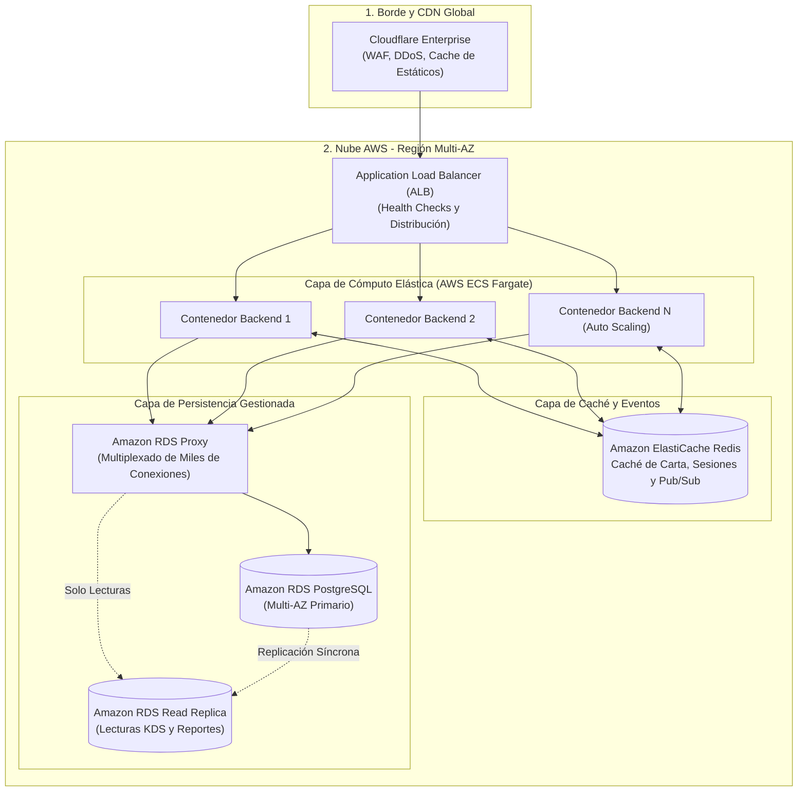

# Práctica 8: Auditoría de Ciberseguridad, Hardening y Escalabilidad

**Módulo:** Despliegue de Aplicaciones Web (2º DAW) / Proyecto Intermodular (2º DAW & DAM)  
**Ciclo Formativo:** Desarrollo de Aplicaciones Web / Multiplataforma  
**Proyecto:** Pizzería Bella Napoli  
**Requisito previo:** Tener la aplicación completamente desplegada y operativa en producción (mediante la [Guía de Despliegue Directo](GUIA_DESPLIEGUE_DIRECTO.md) o las prácticas [P01 a P06](P01_Despliegue_AWS.md)).  
**Tiempo estimado:** 2 sesiones de clase (4 horas)  

---

## 1. Introducción: De Desarrolladores a Auditores de Sistemas

¡Enhorabuena! Tu pizzería artesanal ya está vendiendo en Internet: los comensales piden pizzas desde la WebApp PWA, los cocineros ven las comandas en el monitor KDS, la base de datos corre en la nube de Amazon RDS y el tráfico viaja cifrado a través de un túnel Zero Trust de Cloudflare.

Sin embargo, en el mundo profesional de la ingeniería de software, **que una aplicación "funcione" es solo el 50% del trabajo**.

En esta práctica cambiaremos de rol: dejaremos de ser programadores para convertirnos en **auditores de ciberseguridad (DevSecOps) y arquitectos de sistemas**. Analizaremos de forma implacable nuestra propia infraestructura, descubriremos 4 brechas de seguridad críticas y estudiaremos si nuestro diseño resistiría el volumen de trabajo de una multinacional de comida rápida como Domino's Pizza o Glovo.

```
                      CAMBIO DE PERSPECTIVA EN EL AULA
  ┌─────────────────────────────────┐        ┌─────────────────────────────────┐
  │   FASE 1: DESARROLLO Y LANZADO  │        │  FASE 2: AUDITORÍA & HARDENING  │
  │  "Hacer que todo funcione rápido"│  ───>  │  "Blindar, optimizar y escalar"  │
  │   • Permisos amplios            │        │   • Principio de Mínimo Privilegio│
  │   • Configuración por defecto   │        │   • Cero puertos expuestos      │
  │   • Nodo único experimental     │        │   • Resiliencia ante picos      │
  └─────────────────────────────────┘        └─────────────────────────────────┘
```

---

## BLOQUE 1: Auditoría de Ciberseguridad y "Parche de Día 0"

Cuando un sistema sale a producción con configuraciones permisivas de laboratorio, los atacantes automatizados tardan minutos en detectarlo. En este bloque aplicaremos **Hardening** (endurecimiento defensivo) inmediato en los 4 vectores más vulnerables de nuestra máquina.

---

### Reto 1.1: El Cerrojazo al Puerto 22 (SSH)

#### 🔴 El Problema Detectado
En la fase de aprovisionamiento, abrimos el puerto **22 (SSH)** a `0.0.0.0/0` en el Security Group de AWS (`pizzeria-secgroup`).
* **Riesgo real:** Motores de búsqueda de dispositivos como Shodan o Censys indexan cualquier IP pública con el puerto 22 abierto. Bots maliciosos lanzan miles de intentos por minuto de ataque de fuerza bruta por diccionario contra usuarios típicos (`ubuntu`, `root`, `admin`).
* **La paradoja Zero Trust:** Si nuestro tráfico web viaja por el túnel saliente cifrado de Cloudflare sin abrir puertos, ¿por qué tenemos un puerto abierto al mundo para la administración?

#### 🟢 La Solución de Hardening (2 Alternativas Profesionales)

##### Opción A: Restringir a la IP oficial de EC2 Instance Connect (Recomendada)
Para que los alumnos puedan seguir entrando con un clic desde el navegador de AWS Academy sin que nadie en Internet pueda atacar la máquina:
1. Ve a la consola de **AWS EC2** $\rightarrow$ **Grupos de seguridad** $\rightarrow$ Selecciona `pizzeria-secgroup`.
2. Pulsa en **Editar reglas de entrada** (*Edit inbound rules*).
3. Modifica la regla del puerto 22:
   * **Tipo:** `SSH (22)`
   * **Origen (Source):** Borra `0.0.0.0/0` e introduce el bloque CIDR oficial de AWS para la región `us-east-1` (N. Virginia):  
     👉 **`18.206.107.24/29`**
4. Guarda las reglas.
* **Resultado:** Shodan verá el puerto 22 cerrado/filtrado. Solo la consola web autenticada de AWS puede abrir sesiones SSH.

##### Opción B: "Cero Puertos de Entrada" con Cloudflare Browser SSH (Nivel Avanzado)
1. En el panel de Cloudflare Zero Trust, crea una ruta pública apuntando a `ssh://localhost:22` con renderizado en navegador (*Browser rendering*).
2. Elimina **completamente** la regla del puerto 22 en el Security Group de AWS (0 reglas de entrada).

---

### Reto 1.2: Hardening de DbGate (Adiós a `SKIP_ALL_AUTH`)

#### 🔴 El Problema Detectado
En `docker-compose.db.yml`, el gestor web visual de base de datos se configuró con:
```yaml
- SKIP_ALL_AUTH=true
```
* **Riesgo real:** Cualquiera que descubra la ruta `/dbgate/` entra directamente a administrar la base de datos con privilegios totales, pudiendo ver contraseñas, borrar clientes o descargar la base de datos completa con un solo clic.
* Depender de un `auth_basic` opcional en Nginx es una mala práctica: **la seguridad debe aplicarse en la propia aplicación (Defense in Depth)**.

#### 🟢 La Solución de Hardening
DbGate soporta autenticación nativa por variables de entorno.

1. Abre `docker-compose.db.yml` en tu servidor:
   ```bash
   nano docker-compose.db.yml
   ```
2. En el servicio `dbgate`, elimina la línea `- SKIP_ALL_AUTH=true` y añade credenciales administrativas:
   ```yaml
     # 2. Gestor Visual Web de Base de Datos (DbGate)
     dbgate:
       image: dbgate/dbgate:latest
       container_name: pizzeria-prod-dbgate
       restart: unless-stopped
       environment:
         - WEB_ROOT=/dbgate
         - LOGIN=${DBGATE_USER:-admin}
         - PASSWORD=${DBGATE_PASS:-PizzeriaAdmin_2026!}
         - CONNECTIONS=pizzeria
         - LABEL_pizzeria=AWS RDS Bella Napoli
         - SERVER_pizzeria=${DB_HOST}
         - PORT_pizzeria=${DB_PORT:-5432}
         - USER_pizzeria=${DB_USER}
         - PASSWORD_pizzeria=${DB_PASSWORD}
         - DATABASE_pizzeria=${DB_NAME}
         - ENGINE_pizzeria=postgres@dbgate-plugin-postgres
   ```
3. Reinicia el contenedor:
   ```bash
   docker compose -f docker-compose.db.yml up -d dbgate
   ```
* **Resultado:** Al acceder a `/dbgate/`, la aplicación exige usuario y contraseña antes de mostrar cualquier tabla o dato.

---

### Reto 1.3: Principio de Mínimo Privilegio en PostgreSQL

#### 🔴 El Problema Detectado
El backend de Node.js Express se conecta a Amazon RDS utilizando el **Usuario Maestro** (`pizzeria_user`), el superusuario con el que se aprovisionó la base de datos.
* **Riesgo real:** Si un atacante descubre una vulnerabilidad de Inyección SQL (SQLi) en un formulario o parámetro de la API, tiene privilegios para ejecutar:
  ```sql
  DROP TABLE pedidos;
  DROP DATABASE pizzeria_db;
  ```
* En la industria rige el **Principio de Mínimo Privilegio (PoLP)**: Una API REST solo necesita permisos de lectura y escritura de filas (`SELECT`, `INSERT`, `UPDATE`, `DELETE`), nunca permisos para modificar o destruir la estructura de la base de datos (DDL).

#### 🟢 La Solución de Hardening

1. Entra en **DbGate** (`https://<tu-subdominio>/dbgate/`) con tu usuario maestro.
2. Abre una **Nueva Consulta** (*New Query*) contra `pizzeria_db` y ejecuta el siguiente script SQL de blindaje:

```sql
-- ==============================================================================
-- BLINDAJE DE SEGURIDAD: USUARIO DE APLICACIÓN CON MÍNIMO PRIVILEGIO (PoLP)
-- ==============================================================================

-- 1. Crear el usuario de aplicación para la API
CREATE USER pizzeria_app WITH PASSWORD 'PizzeriaApp_Secure_2026!';

-- 2. Conceder derecho de conexión y uso del esquema
GRANT CONNECT ON DATABASE pizzeria_db TO pizzeria_app;
GRANT USAGE ON SCHEMA public TO pizzeria_app;

-- 3. Conceder ÚNICAMENTE permisos DML sobre las tablas existentes
GRANT SELECT, INSERT, UPDATE, DELETE ON ALL TABLES IN SCHEMA public TO pizzeria_app;

-- 4. Conceder permisos sobre secuencias (IDs autoincrementales SERIAL)
GRANT USAGE, SELECT ON ALL SEQUENCES IN SCHEMA public TO pizzeria_app;

-- 5. Revocar permisos de creación o alteración de esquemas
REVOKE CREATE ON SCHEMA public FROM pizzeria_app;

-- 6. Garantizar que futuras tablas creadas hereden esta restricción
ALTER DEFAULT PRIVILEGES IN SCHEMA public 
GRANT SELECT, INSERT, UPDATE, DELETE ON TABLES TO pizzeria_app;

ALTER DEFAULT PRIVILEGES IN SCHEMA public 
GRANT USAGE, SELECT ON SEQUENCES TO pizzeria_app;
```

3. Actualiza el archivo `.env` en tu servidor EC2 para que el backend utilice el nuevo usuario:
   ```ini
   DB_USER=pizzeria_app
   DB_PASSWORD=PizzeriaApp_Secure_2026!
   ```
4. Reinicia el backend:
   ```bash
   docker compose -f docker-compose.app.yml up -d --build backend
   ```
* **Comprobación:** La web y la app siguen creando y cobrando pedidos con normalidad. Pero si alguien intenta inyectar un `DROP TABLE`, PostgreSQL rechazará la orden con `permission denied for schema public`.

---

### Reto 1.4: Higiene de Secretos y Permisos POSIX en Linux

#### 🔴 El Problema Detectado
En Linux, los archivos creados por defecto suelen recibir permisos `644` (`-rw-r--r--`).
* **Riesgo real:** Cualquier usuario sin privilegios o proceso local comprometido dentro del servidor puede leer el contenido de `.env`, extrayendo las claves secretas de **Stripe** y las contraseñas de la base de datos.
* Además, si un alumno ejecuta accidentalmente `git add .` sin un `.gitignore` estricto, las claves privadas terminan expuestas en GitHub público.

#### 🟢 La Solución de Hardening

Ejecuta en la terminal de tu EC2:

```bash
# 1. Verificar y blindar que .env nunca suba a Git
grep -qxF ".env" .gitignore || echo ".env" >> .gitignore

# 2. Asignar la propiedad al usuario 'ubuntu' y grupo 'docker'
sudo chown ubuntu:docker .env

# 3. Aplicar permisos POSIX estrictos (600: solo lectura y escritura del propietario)
chmod 600 .env

# 4. Verificar la máscara de permisos
ls -la .env
# Salida esperada: -rw------- 1 ubuntu docker ... .env
```

---

## BLOQUE 2: Auditoría de Viabilidad FoodTech y Escalabilidad

Una vez tapadas las brechas de seguridad, nos enfrentamos a la pregunta de negocio:  
**¿Aguantaría esta arquitectura si nos convertimos en el próximo Domino's Pizza o Glovo?**

---

### Análisis 2.1: El Mito del "Tiempo Real" (Polling vs SSE vs WebSockets)

#### El Diagnóstico Actual
Actualmente, el monitor de cocina (KDS) y el Pizza Tracker de la app móvil realizan **Short Polling** (peticiones periódicas cada pocos segundos a `/api/pedidos`).

```
                    EL COSTE OCULTO DEL POLLING EN MASA
  1.000 Clientes activos con el Tracker abierto cada 3 segundos:
  ┌──────────────┐     GET /api/pedidos/104      ┌──────────────┐
  │ Navegador    │ ────────────────────────────> │  Backend     │ ──> SELECT en RDS
  │ Cliente      │ <──────────────────────────── │  Node.js     │ <── "Estado: En horno"
  └──────────────┘      (200 OK - Sin cambios)   └──────────────┘
  
  Cálculo: 1.000 clientes * 20 peticiones/min = 20.000 peticiones HTTP/minuto.
  El 99% de las respuestas no aportan información nueva (el estado no ha cambiado).
```

#### Requisitos de Ingeniería para Escalar a Tiempo Real
Para migrar a **Server-Sent Events (SSE)** o **WebSockets**, la capa de Nginx y el backend deben garantizar:

1. **Desactivar el Buffering en el Proxy Inverso:**  
   Nginx por defecto acumula respuestas en búfer antes de enviarlas al cliente. En streaming, esto provocaría que los eventos lleguen con retraso o a ráfagas. Requiere:
   ```nginx
   proxy_buffering off;
   proxy_cache off;
   ```
2. **Sincronización de Timeouts y Heartbeats (Keep-Alive):**  
   Tanto Cloudflare como Nginx cierran conexiones inactivas tras 60-100 segundos. El backend debe emitir paquetes "latido" (*ping/pong* o comentarios `: keepalive\n\n`) periódicamente.
3. **El Problema del Estado Distribuido:**  
   En un servidor único, un `Map` en la memoria de Node.js basta para recordar quién está conectado. Pero en cuanto tengamos 5 réplicas de backend detrás de un balanceador, si el cocinero avisa del pedido en el servidor A, el cliente conectado al servidor B no se enterará. Se necesita un **Bus de Eventos centralizado** (como **Redis Pub/Sub**).

---

### Análisis 2.2: Inventario Transaccional Fino (Gramos de Queso vs "Hot Rows")

#### El Salto Conceptual
En nuestra pizzería actual, el stock son simplemente pizzas en la carta (`disponible = true/false`).  
En la hostelería industrial (FoodTech), el inventario se gestiona por **materias primas**:
* 1 Pizza Margherita descuenta: 250g de masa, 120g de mozzarella Fior di Latte, 90g de tomate San Marzano y 5ml de aceite de oliva.

#### El Cuello de Botella en Amazon RDS (`db.t4g.micro`)
Si 100 clientes piden pizzas simultáneamente un sábado por la noche:
1. **La Fila Caliente (*Hot Row*):** Todas las transacciones concurrentes intentarán actualizar la misma fila de la tabla `ingredientes` (la fila de la *Mozzarella* y la *Masa*):
   ```sql
   UPDATE ingredientes SET stock = stock - 120 WHERE id = 1; -- Mozzarella
   ```
2. **Serialización y Bloqueos:** PostgreSQL bloqueará esa fila para cada transacción. Las peticiones formarán una cola de espera.
3. **El Riesgo de Deadlock:** Si la Comanda A pide [Masa, Queso, Jamón] y la Comanda B pide [Jamón, Queso, Masa], si no se actualizan en el mismo orden determinista por ID, la base de datos abortará transacciones por **bloqueo mutuo (*Deadlock*)**.

#### Estrategias Profesionales de Mitigación
* **Modelo Ledger (Libro Diario de Movimientos):** En vez de modificar un contador mutable (`UPDATE stock = stock - X`), cada pedido inserta una línea en un historial de movimientos (`INSERT INTO movimientos_stock (ingrediente_id, cantidad, tipo)`). Las inserciones nunca se bloquean entre sí.
* **Bloqueo Pesimista Ordenado:** `SELECT ... FOR UPDATE` ordenando siempre por `ingrediente_id ASC`.
* **Desacople Asíncrono:** La confirmación del pedido y cobro se realiza de inmediato; el descuento fino de gramos de inventario se delega a una **cola de mensajes en segundo plano (Worker con AWS SQS o RabbitMQ)**.

---

### Análisis 2.3: La Prueba de Fuego: "La Final de la Champions"

Imagina que juega la final de la Champions League un sábado a las 20:30h. El tráfico se multiplica por 50 en 15 minutos. **Nuestra infraestructura actual no auto-escala.**

#### ¿Por dónde se rompería primero el sistema? (Efecto Dominó)

```
                              CADENA DE COLAPSO
  [Pico Masivo] ──> [1. CPU Burstable EC2 Agotada] ──> [2. Pool RDS Saturado (15/15)]
                             │                                    │
                             ▼                                    ▼
                    [3. OOM Killer mata Node]            [4. Error 502 Bad Gateway]
```

1. **Primer fallo: Créditos de CPU de la `t3.small`:**  
   Las instancias `t3` son de rendimiento burstable. Al mantener la CPU al 100% procesando peticiones, los créditos acumulados se agotan en minutos. El rendimiento de la CPU cae bruscamente a su línea base (~20%), disparando la latencia de respuesta.
2. **Segundo fallo: Saturación del Pool de Conexiones de Base de Datos:**  
   En `backend/src/config/db.js`, el pool está configurado con `max: 15`. Con transacciones ralentizadas por la CPU, las 15 conexiones se ocupan al 100%. Las nuevas peticiones entran en cola de espera hasta dar timeout.
3. **Tercer fallo: El OOM Killer (*Out of Memory*):**  
   Nginx, Node.js, DbGate, la WebApp QR y Cloudflare comparten solo 2 GiB de RAM. La acumulación de conexiones pendientes en memoria provocará que el kernel de Linux ejecute el OOM Killer y termine el proceso de Node.js o Nginx. Los clientes recibirán errores **502 Bad Gateway**.

---

### Hoja de Ruta: El Siguiente Paso Arquitectónico en AWS

Para transformar nuestra pizzería de un **MVP educativo** a una **plataforma de alta disponibilidad para millones de usuarios**, la arquitectura evolucionaría hacia:



1. **Cómputo sin estado en AWS ECS Fargate:** Eliminar la máquina virtual EC2. Los contenedores de Node.js corren sin servidor, escalando automáticamente de 2 a 50 réplicas según el uso de CPU y peticiones por segundo.
2. **Amazon RDS Proxy:** Colocado delante de PostgreSQL, multiplexa miles de peticiones de clientes sobre un número reducido de conexiones reales a la base de datos, evitando que RDS colapse por sobrecarga de sockets.
3. **Caché en Memoria con Redis:** El catálogo de pizzas y precios se sirve en < 2 milisegundos desde memoria caché, liberando a PostgreSQL de procesar consultas repetitivas de lectura.
4. **Réplicas de Lectura (*Read Replicas*):** Las consultas pesadas del monitor de cocina KDS y los informes de arqueo de caja se dirigen a una réplica de solo lectura, reservando la base de datos principal exclusivamente para cobros y creación de pedidos.

---

## 3. Rúbrica de Entrega y Cuestionario de Evaluación

Para superar esta práctica, cada alumno debe entregar una breve memoria técnica en PDF o Markdown respondiendo a los siguientes puntos:

1. **Evidencia de Hardening:** Captura de pantalla de la regla de entrada de tu Security Group en AWS demostrando que el puerto 22 ya no está abierto a `0.0.0.0/0`.
2. **Evidencia de Mínimo Privilegio:** Captura de pantalla en DbGate ejecutando un comando `DROP TABLE` con el usuario `pizzeria_app` demostrando que el motor de base de datos rechaza la operación por falta de permisos.
3. **Pregunta de Debate:** Si una pizzería pasa de 1 local a 20 franquicias en diferentes ciudades, ¿qué ventajas aportaría tener réplicas de lectura en RDS frente a aumentar el tamaño de la instancia a una máquina más grande (*Escalado Vertical vs Horizontal*)?
4. **Pregunta de Reflexión:** Explica por qué en una arquitectura moderna el archivo `.env` nunca debe subirse al repositorio de código fuente, incluso aunque el repositorio sea privado.
