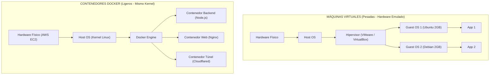
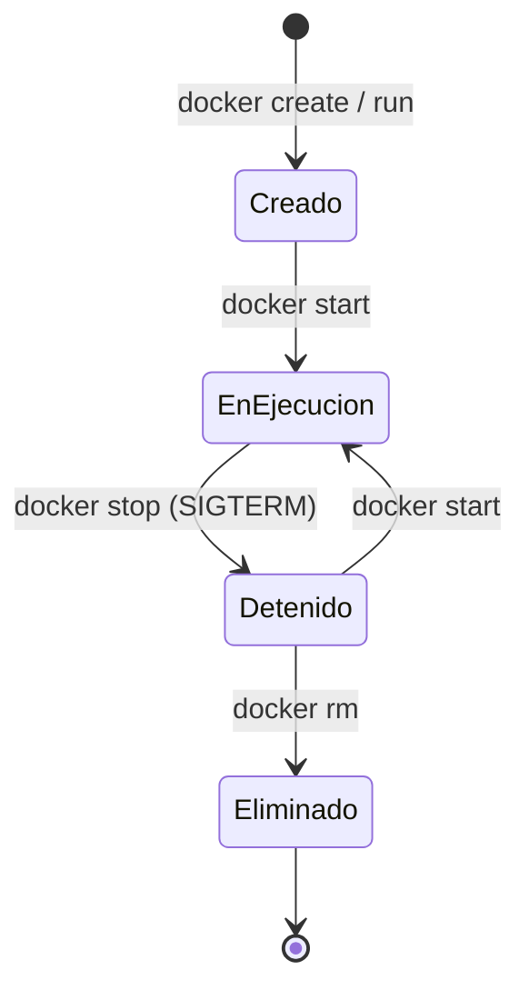
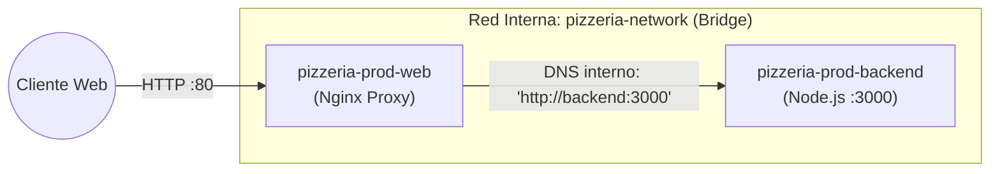

# T01: Fundamentos de Docker (Manual de Supervivencia)

> **Módulo:** Despliegue de Aplicaciones Web (2º DAW) / Sistemas y Redes (2º DAM)  
> **Ciclos Formativos:** DAW & DAM — IES La Mola  
> **Proyecto:** Pizzería Bella Napoli  
> **Metodología:** *Top-Down* — Destripando la infraestructura real de producción.

En este manual vamos a desmontar y entender la tecnología subyacente que hace funcionar nuestra pizzería en AWS, permitiéndote ser 100% autónomo para empaquetar, depurar y desplegar cualquier proyecto en el mundo profesional.

---

## Índice del Manual

1. [De la Máquina Virtual al Contenedor](#capítulo-1-de-la-máquina-virtual-al-contenedor)
2. [Imágenes vs. Contenedores (La Receta y la Pizza)](#capítulo-2-imágenes-vs-contenedores-la-receta-y-la-pizza)
3. [Destripando el Proyecto: El Dockerfile del Backend](#capítulo-3-destripando-el-proyecto-el-dockerfile-del-backend)
4. [El Kit de Supervivencia: Ciclo de Vida y Terminal](#capítulo-4-el-kit-de-supervivencia-ciclo-de-vida-y-terminal)
5. [Persistencia y Redes Aisladas](#capítulo-5-persistencia-y-redes-aisladas)
6. [Docker Compose: El Director de Orquesta](#capítulo-6-docker-compose-el-director-de-orquesta)

---

## Capítulo 1: De la Máquina Virtual al Contenedor

### El problema histórico: *"En mi máquina funciona"*
Imagina que terminas de programar una API en Node.js. En tu ordenador portátil funciona a la perfección. La subes a un servidor en la nube (nuestra instancia EC2 con Ubuntu) y de repente explota:
* En tu portátil tenías Node.js 20, pero el servidor tiene Node.js 16 por defecto.
* En tu portátil tenías una variable de entorno configurada y en el servidor no existe.
* El puerto 3000 ya lo está usando otro proceso del sistema operativo.

### La solución clásica: Máquinas Virtuales (VM)
Para solucionar esto, históricamente se creaban Máquinas Virtuales (VirtualBox, VMware, KVM). Una VM emula un ordenador completo desde el hardware virtualizado hasta el Sistema Operativo huésped (*Guest OS*).
* **Desventajas:** Cada VM pesa varios Gigabytes, tarda minutos en arrancar y desperdicia muchísima memoria RAM y CPU duplicando sistemas operativos completos.

### La solución moderna: Contenedores Docker
Docker no virtualiza hardware; **virtualiza el Sistema Operativo**. 

Un contenedor empaqueta tu código fuente junto con sus dependencias exactas, pero **comparte el núcleo (Kernel de Linux) de la máquina anfitriona** (nuestra instancia EC2).



### ¿Por qué lo usamos en la Pizzería Bella Napoli?
En lugar de instalar Node.js, Nginx y librerías directamente sobre el sistema operativo de nuestra máquina en AWS, hemos metido cada pieza en su propia **"caja estanca"**. Si el backend sufre un desbordamiento de memoria o se apaga, Nginx y la base de datos continúan operando sin verse afectados.

---

## Capítulo 2: Imágenes vs. Contenedores (La Receta y la Pizza)

Para entender Docker es fundamental dominar esta analogía:

* **La Imagen (La Receta / La Plantilla):**
  Es un archivo estático, inmutable y de solo lectura. Contiene el sistema operativo base mínimo, las librerías instaladas y tu código fuente. No está "viva" ni consume memoria RAM.
* **El Contenedor (La Pizza Horneada / La Instancia):**
  Es la ejecución viva de una imagen en memoria. A partir de una sola imagen de backend podemos levantar 1, 3 o 50 contenedores idénticos funcionando a la vez en distintos puertos.

$$\text{Dockerfile (Código)} \xrightarrow{\text{docker build}} \text{Imagen (Receta estática)} \xrightarrow{\text{docker run}} \text{Contenedor (Proceso en ejecución)}$$

---

## Capítulo 3: Destripando el Proyecto: El Dockerfile del Backend

Un `Dockerfile` es el fichero de instrucciones donde le explicamos a Docker cómo debe cocinar la imagen de nuestra aplicación.

A continuación analizamos el archivo real de nuestra pizzería ([backend/Dockerfile](file:///d:/guillermo/IES%20La%20Mola/pizzeria-base/backend/Dockerfile)):

```dockerfile
# 1. Imagen base ultraligera
FROM node:20-alpine

# 2. Carpeta de trabajo dentro del contenedor
WORKDIR /app

# 3. Copiar manifiestos de dependencias
COPY package*.json ./

# 4. Instalar dependencias de producción
RUN npm install --omit=dev

# 5. Copiar el resto del código fuente del backend
COPY . .

# 6. Exponer el puerto de la API REST
EXPOSE 3000

# 7. Comando de arranque
CMD ["node", "src/server.js"]
```

### Análisis Línea a Línea:

#### 1. `FROM node:20-alpine`
* **¿Qué hace?** Establece la imagen base oficial sobre la que construiremos la nuestra.
* **El truco de ingeniería:** Usamos la etiqueta `alpine`. Alpine Linux es una distribución hiperligera de Linux de tan solo **~5 MB** de peso (frente a los ~1.000 MB que pesa la imagen de Node sobre Debian). Esto reduce los tiempos de descarga y minimiza drásticamente las vulnerabilidades de seguridad (superficie de ataque).

#### 2. `WORKDIR /app`
* **¿Qué hace?** Equivale a un comando `mkdir /app && cd /app` dentro del contenedor. Todo lo que ejecutemos a partir de esta línea ocurrirá dentro de esa carpeta.

#### 3. `COPY package*.json ./` y `4. RUN npm install --omit=dev`
* **¿Por qué separamos esto en dos pasos? (La magia del *Layer Caching*):**
  Docker construye las imágenes por capas superpuestas. Si cambiáramos una sola línea de código en `src/server.js` y hubiéramos hecho `COPY . .` al principio, Docker invalidaría la caché y tendría que reinstalar todas las librerías cada vez que compilamos.  
  Al copiar **solo** el archivo `package.json` primero, Docker detecta si has añadido librerías nuevas o no:
  * Si no has tocado dependencias $\rightarrow$ Reutiliza la capa ya descargada en **0.1 segundos**.
* El flag `--omit=dev` evita instalar herramientas que solo se usan en desarrollo local, ahorrando espacio en disco.

#### 5. `COPY . .`
* Copia el resto del código de nuestra API (controladores, rutas, modelos) desde la máquina anfitriona hacia `/app` dentro del contenedor.

#### 6. `EXPOSE 3000`
* Es una instrucción documental de metadatos. Informa a Docker y a otros desarrolladores de que este contenedor escucha tráfico de red por el puerto 3000.

#### 7. `CMD ["node", "src/server.js"]`
* **La gran diferencia entre `RUN` y `CMD`:**
  * `RUN` se ejecuta **durante la construcción de la imagen** (`docker build`).
  * `CMD` es el comando que se ejecuta **cuando el contenedor arranca** (`docker run`). En nuestro caso, arranca el servidor web Express de la pizzería.

---

## Capítulo 4: El Kit de Supervivencia: Ciclo de Vida y Terminal

En el día a día administrando la pizzería en AWS EC2, no interactuamos con interfaces gráficas: todo se gestiona desde la terminal. Estos son los **4 comandos indispensables** para diagnosticar y operar el sistema en producción.



---

### 1. ¿Quién está vivo y quién ha muerto?: `docker ps` vs `docker ps -a`

* **`docker ps` (Solo los vivos):**  
  Muestra únicamente los contenedores que están actualmente encendidos y corriendo (`Up`).
  ```bash
  docker ps
  ```
  Si tu API se ha caído por un error de sintaxis, **aquí no aparecerá**, lo que puede hacerte creer falsamente que el contenedor no existe.

* **`docker ps -a` (El "tanatorio" de contenedores):**  
  El modificador `-a` (*all*) muestra **todos los contenedores**, incluidos los detenidos o los que han fallado (`Exited`).
  ```bash
  docker ps -a
  ```
  > 💡 **Tip de diagnóstico:** Si ves un estado `Exited (1)` o `Exited (137)`, sabrás que el proceso crasheó o fue eliminado por el sistema por falta de memoria RAM (*Out Of Memory*).

---

### 2. Control del Ciclo de Vida: `docker stop`, `docker start` y `docker rm`

* **`docker stop <nombre>`:**  
  Envía una señal de apagado ordenado (`SIGTERM`) al proceso para que cierre conexiones con la base de datos limpiamente antes de detenerse:
  ```bash
  docker stop pizzeria-prod-backend
  ```
* **`docker start <nombre>`:**  
  Vuelve a encender un contenedor que estaba apagado sin recrearlo ni perder su estado:
  ```bash
  docker start pizzeria-prod-backend
  ```
* **`docker rm <nombre>` (Destruir contenedor):**  
  Elimina el contenedor del disco. Solo se pueden borrar contenedores que estén previamente detenidos:
  ```bash
  docker stop pizzeria-prod-backend
  docker rm pizzeria-prod-backend
  ```
  *(Para forzar la eliminación de un contenedor bloqueado sin detenerlo antes: `docker rm -f <nombre>`).*

---

### 3. Diagnóstico en Vivo: `docker logs -f`

En Node.js, todo lo que tu código imprime con `console.log()` o `console.error()` es capturado por Docker.

```bash
docker logs pizzeria-prod-backend --tail 15
```
Muestra las últimas 15 líneas registradas en el servidor.

#### Caso de uso real: Auditoría del Webhook de Stripe en vivo
Cuando un cliente paga con tarjeta en Stripe, los servidores de Stripe lanzan una petición HTTP asíncrona hacia nuestro servidor (`POST /api/pagos/webhook`). ¿Cómo sabemos si el evento ha llegado y si la firma criptográfica ha sido validada?

Añadimos el flag **`-f`** (*follow* / seguir en directo):
```bash
docker logs pizzeria-prod-backend -f
```
La terminal se quedará a la escucha. En el instante exacto en que completes el pago en Stripe, verás desfilar por tu pantalla:
```text
📥 [Stripe Webhook] Evento recibido: checkout.session.completed
✔ Firma criptográfica verificada con éxito
🍕 [Pedido #104] Estado de pago actualizado a 'PAGADO' en PostgreSQL
```
*(Para salir de la visualización en vivo, pulsa `Ctrl + C`).*

---

### 4. Teletransporte al interior del contenedor: `docker exec -it`

A veces necesitas entrar físicamente "dentro" del contenedor para inspeccionar archivos, probar la red o verificar configuraciones internas.

```text
docker exec  -it  pizzeria-prod-web  sh
│            │    │                  └─ Intérprete de comandos (Shell)
│            │    └──────────────────── Contenedor destino
│            └───────────────────────── -i (Interactivo) + -t (Terminal TTY)
└────────────────────────────────────── Ejecutar un comando dentro
```

#### Caso de uso real: Depuración de Nginx cuando la API no responde
Imagina que un cliente entra a la web y recibe un error `502 Bad Gateway` al pedir pizzas. ¿El fallo está en Nginx o en Node.js?

1. **Entramos dentro del contenedor de Nginx:**
   ```bash
   docker exec -it pizzeria-prod-web sh
   ```
   > ⚠️ **Atención técnica con Alpine:** Como Nginx corre sobre Alpine Linux ultraligero, **no tiene `bash` instalado**. Debemos invocar su shell nativo: **`sh`**.

2. **Verificamos la sintaxis del archivo de configuración de Nginx:**
   ```sh
   nginx -t
   ```
   *(Si falta un punto y coma o hay una directiva mal escrita, Nginx te dirá la línea exacta).*

3. **Probamos si Nginx puede "hablar" con el backend por la red interna:**
   Desde dentro del contenedor de Nginx, lanzamos una petición HTTP directa al nombre DNS del backend en el puerto 3000:
   ```sh
   wget -qO- http://backend:3000/api/health
   ```
   * Si devuelve `{"status":"UP"...}` $\rightarrow$ La red de Docker funciona y el backend está sano.
   * Si se queda colgado o da error $\rightarrow$ El backend está apagado o en bucle de reinicio.

4. **Salir del contenedor:**
   ```sh
   exit
   ```

---

## Capítulo 5: Persistencia y Redes Aisladas

### 1. Redes Internas: El DNS Mágico de Docker
Por defecto, cada contenedor que creas nace en su propio ecosistema de red aislado. Si dos contenedores necesitan comunicarse, debemos conectarlos a una misma red virtual (en nuestro caso, una red de tipo *Bridge* llamada `pizzeria-network`).



#### ¿Por qué no usamos direcciones IP? (El DNS interno)
En redes físicas tradicionales, configurarías IPs fijas (ej. `192.168.1.50`). En Docker eso es una mala práctica porque las IPs de los contenedores son dinámicas: cada vez que un contenedor se reinicia o se recompila, Docker le asigna una IP diferente (ej. `172.18.0.3`, `172.18.0.4`).

Para solucionar esto, Docker incluye un **servidor DNS interno integrado**:
* En el archivo de configuración real de nuestro proxy ([frontend-web/nginx.conf](file:///d:/guillermo/IES%20La%20Mola/pizzeria-base/frontend-web/nginx.conf)):
  ```nginx
  location ^~ /api/ {
      proxy_pass http://backend:3000/api/;
  }
  ```
* Nginx no tiene ni idea de qué IP tiene el backend. Simplemente le pide datos a `http://backend:3000`.
* El motor de Docker intercepta la palabra `backend` y la traduce automáticamente y al vuelo a la IP privada que tenga el contenedor en ese instante.

---

### 2. Persistencia de Datos: Volúmenes vs. Bind Mounts

#### El gran problema: Los contenedores son "amnésicos"
El sistema de archivos de un contenedor es efímero. Cuando un contenedor escribe datos (un archivo subido, un log o una tabla), lo guarda en una capa temporal de lectura/escritura. Si ejecutas `docker rm`, **todo lo que había dentro desaparece para siempre**.

Para conservar datos o compartir archivos con el host disponemos de dos mecanismos:

| Mecanismo | ¿Dónde vive? | Caso de uso ideal |
| :--- | :--- | :--- |
| **Volumen gestionado (*Named Volume*)** | Carpeta interna protegida y gestionada por Docker (`/var/lib/docker/volumes/...`). | Bases de datos locales pesadas. *(En nuestra pizzería delegamos la persistencia en AWS RDS por alta disponibilidad y seguridad).* |
| **Punto de montaje (*Bind Mount*)** | Una ruta exacta de tu disco duro físico (ej. `~/pizzeria-base/.htpasswd`). | Archivos de configuración que queremos editar desde fuera sin reconstruir la imagen. |

#### Caso de uso real en la Pizzería: El Bind Mount del `.htpasswd`
En la **Práctica 5**, para proteger el panel `/dbgate/` con usuario y contraseña sin tener que reconstruir la imagen de Nginx cada vez que cambiamos una clave, usamos un *Bind Mount* en [docker-compose.app.yml](file:///d:/guillermo/IES%20La%20Mola/pizzeria-base/docker-compose.app.yml):

```yaml
  frontend-web:
    container_name: pizzeria-prod-web
    # ...
    volumes:
      - ./.htpasswd:/etc/nginx/.htpasswd:ro
```

* **`./.htpasswd`:** El archivo que creamos en el Ubuntu de nuestra EC2 con `openssl`.
* **`:/etc/nginx/.htpasswd`:** La ruta dentro del contenedor donde Nginx irá a buscarlo.
* **`:ro` (*Read-Only*):** **Principio de Mínimo Privilegio.** Nginx solo necesita leer las contraseñas. Si alguien vulnerara el servidor web, no podría alterar el archivo de claves porque está montado en solo lectura.

---

## Capítulo 6: Docker Compose: El Director de Orquesta

### De lo manual a la Infraestructura como Código (IaC)
Hasta ahora hemos visto comandos sueltos (`docker run`, `docker build`). Si tuviéramos que arrancar nuestra pizzería a mano, tendríamos que escribir en la terminal una ristra de comandos interminable conectando puertos, variables y redes:
```bash
# ¡La forma propensa a errores que nadie usa en producción!
docker run -d --name backend --network pizzeria-network -e DB_HOST=... pizzeria-backend
docker run -d --name web -p 80:80 --network pizzeria-network pizzeria-web
docker run -d --name tunnel --network pizzeria-network cloudflared ...
```

**Docker Compose** resuelve esto aplicando el concepto de **Infraestructura como Código (IaC)**: defines todos los servicios de tu aplicación en un único archivo YAML reproducible y versionable en Git.

---

### Destripando nuestro `docker-compose.app.yml`

A continuación analizamos la estructura real de nuestra capa de aplicación:

```yaml
name: pizzeria-app

services:
  # 1. API REST en Node.js
  backend:
    build:
      context: ./backend
      dockerfile: Dockerfile
    container_name: pizzeria-prod-backend
    restart: unless-stopped
    environment:
      NODE_ENV: production
      PORT: ${BACKEND_PORT:-3000}
      DB_HOST: ${DB_HOST:-db}
      STRIPE_SECRET_KEY: ${STRIPE_SECRET_KEY:-}
    networks:
      - pizzeria-network

  # 2. Servidor Web y Proxy Inverso
  frontend-web:
    build:
      context: ./frontend-web
    container_name: pizzeria-prod-web
    restart: unless-stopped
    ports:
      - "${HTTP_PORT:-80}:80"
    depends_on:
      - backend
    networks:
      - pizzeria-network

networks:
  pizzeria-network:
    external: true
```

#### Elementos clave a entender:
* **`build`:** Le dice a Compose dónde está el `Dockerfile` para compilar la imagen si no existe.
* **`${VARIABLE:-valor_defecto}`:** Inyección limpia desde el archivo `.env`. Si la variable no está en el `.env`, toma el valor por defecto tras los dos puntos.
* **`ports: "80:80"`:** Mapea el puerto del Host (EC2) al del contenedor (`Host:Contenedor`). Solo Nginx expone el puerto 80 hacia fuera; el backend queda protegido dentro de la red interna.
* **`depends_on`:** Marca el orden de arranque: Nginx no arranca hasta que el backend esté listo.
* **`networks: external: true`:** Indica que la red `pizzeria-network` ya fue creada previamente (por la capa de base de datos) y se comparte entre ambos entornos.

---

### Comandos Clave del Director de Orquesta

```bash
# 1. Levantar y compilar toda la infraestructura en segundo plano (-d)
docker compose -f docker-compose.app.yml up -d --build

# 2. Ver el estado de todos los servicios coordinados
docker compose -f docker-compose.app.yml ps

# 3. Recrear un solo servicio tras editar el .env (¡El comando correcto para recargar variables!)
docker compose -f docker-compose.app.yml up -d backend

# 4. Detener y eliminar todos los contenedores y redes de forma limpia
docker compose -f docker-compose.app.yml down
```
